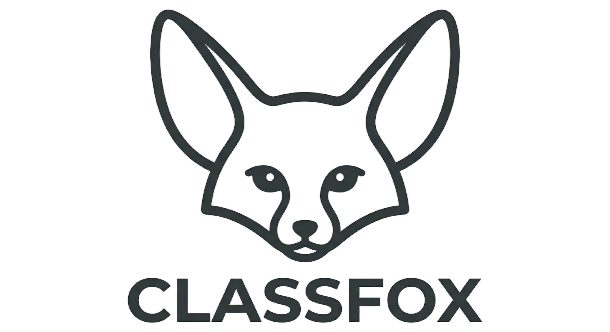

# 🦊 课狐 ClassFox (macOS) - 你的上课摸鱼搭子 🐟

> 📚 项目文档：<https://ouyangyipeng.github.io/ClassAssistant/>

<!-- markdownlint-disable MD033 -->
<div align="center">
  
  <br />
  <a href="https://github.com/ouyangyipeng/ClassAssistant/stargazers">
    
  </a>
  <a href="https://github.com/ouyangyipeng/ClassAssistant/issues">
    
  </a>
</div>
<!-- markdownlint-enable MD033 -->

> **注意**：本仓库专门针对 **macOS** 平台进行了深度优化与适配。

> ClassFox — Hears what you miss.
>
> 课狐 ClassFox —— 听见你的错过，接住你的惊慌。
>
> 以耳廓狐为灵感的小体量课堂悬浮助手：资源占用轻，专门盯住你最容易错过的点名、提问和进度变化。

## 🚀 macOS 版本特性 (v1.2.0)

- **原生架构支持**：支持 Intel (x86_64) 与 Apple Silicon (M1/M2/M3) 原生编译。
- **单文件后端集成**：后端 Python 服务已打包为单文件二进制，并完美集成在 `.app` 包内的 `Resources` 目录中。
- **智能路径探测**：Rust 主程序启动时会自动探测 `Resources/backend` 路径，实现零配置拉起后端。
- **权限自动处理**：构建脚本会自动处理 macOS 下的可执行权限（chmod +x）。
- **标准 DMG 分发**：提供自动化脚本，一键生成符合 macOS 规范的 DMG 安装包。

## ✨ 核心功能

| 功能 | 说明 |
| ------ | ------ |
| 🎙️ 实时语音监控 | Local ASR / Seed-ASR / DashScope / Mock 多模式切换 |
| 🧹 去重转录 | 流式识别结果按句落盘，过滤重复、碎片标点和相近修正文 |
| 🧠 滚动课堂摘要 | 每累计 50 条课堂记录，自动压缩为一段历史摘要 |
| 🚨 点名预警 | 命中关键词后通过 WebSocket 推送红色警报弹层 |
| 🆘 一键救场 | 结合最近转录和课程资料，生成应答思路与参考答案 |
| 📍 老师讲到哪了 | 对最近课堂内容做即时进度总结 |
| 📝 课后总结 | 生成 Markdown 课堂笔记 |

## 🏗️ 架构概览 (macOS)

```text
Tauri + React UI (App Bundle)
        │
        ├─ Contents/MacOS/app-ui (主程序)
        └─ Contents/Resources/backend/ (后端资源)
                │
          FastAPI Backend (Single File)
                │
      ┌─────────┼─────────┐
      │         │         │
    ASR       LLM     Transcript
```

## 🚀 快速开始

### 1. 环境准备

确保您的 Mac 已安装：
- **Python 3.10+** (建议使用 `uv` 或 `pyenv`)
- **Node.js 18+**
- **Rust** (通过 `rustup` 安装)

### 2. 配置后端

```bash
cd api-service
python -m venv .venv
source .venv/bin/activate
pip install -r requirements.txt
pip install pyinstaller
```

### 3. 配置前端

```bash
cd ../app-ui
npm install
```

### 4. 开发模式启动

```bash
# 启动后端 (终端 A)
cd api-service
source .venv/bin/activate
uvicorn main:app --host 127.0.0.1 --port 8765 --reload

# 启动前端 (终端 B)
cd app-ui
npm run tauri dev
```

## 📦 打包发布 (macOS)

我们提供了一个全自动化的构建脚本，它会同时处理 Python 后端打包和 Tauri 前端构建。

### 自动化构建命令

```bash
# 赋予执行权限
chmod +x ./app-ui/build-with-backend.sh

# 默认构建（一次同时构建 arm64 和 x86_64）
./app-ui/build-with-backend.sh
```

### 构建产物

- **arm64 .app**：`app-ui/src-tauri/target/aarch64-apple-darwin/release/bundle/macos/课狐ClassFox.app`
- **arm64 DMG**：`app-ui/src-tauri/target/aarch64-apple-darwin/release/bundle/dmg/课狐ClassFox_1.2.0_arm64.dmg`
- **x86_64 .app**：`app-ui/src-tauri/target/x86_64-apple-darwin/release/bundle/macos/课狐ClassFox.app`
- **x86_64 DMG**：`app-ui/src-tauri/target/x86_64-apple-darwin/release/bundle/dmg/课狐ClassFox_1.2.0_x86_64.dmg`

### ⚠️ 重要提示：backend 架构

脚本现在会复用现有 Rust/Tauri 构建缓存，不会在每次构建前执行 `cargo clean` 或删除 `src-tauri/target`。

但嵌入到 App Bundle 中的 Python backend 仍然按当前宿主机架构构建；如果你要交付“前后端都严格匹配”的双架构安装包，仍然需要分别在对应架构环境下准备 backend。

## 🎙️ ASR 模式说明

| 模式 | 说明 |
| ------ | ------ |
| local | 基于 SpeechRecognition，按句回调，macOS 下表现稳定 |
| dashscope | 阿里云百炼 Fun-ASR |
| seed-asr | 字节 Seed-ASR，高精度流式识别 |

## 📝 更新说明 (v1.2.0 macOS)

- **One-File 适配**：将 Python 后端改为单文件模式，极大提升了在 macOS App Bundle 内的运行稳定性。
- **资源路径对齐**：修复了 macOS 下 `Contents/Resources` 路径解析失败的问题。
- **架构兼容性**：支持多架构交叉编译与 DMG 自动化打包。
- **启动优化**：解决了 macOS 下后端进程残留与端口占用的问题。

## License

MIT
